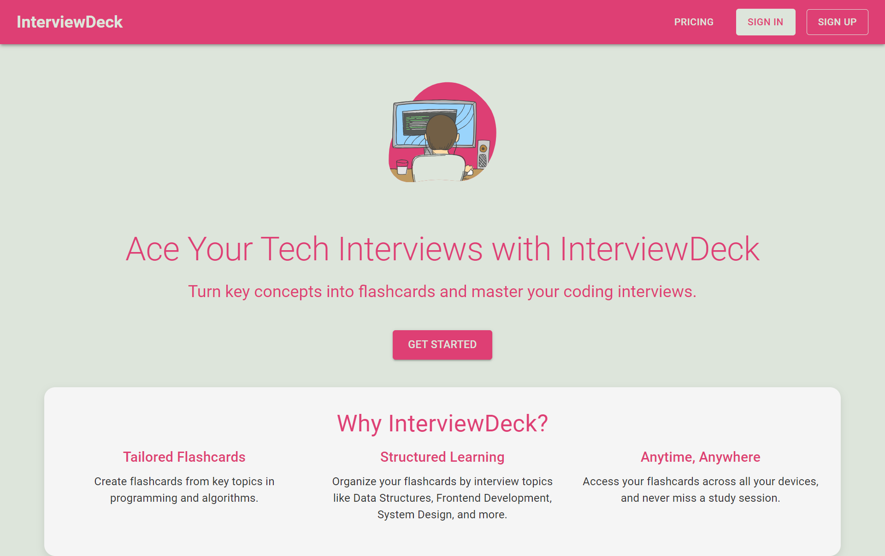

# InterviewDeck

[Visit the InterviewDeck website](https://interviewdeck.vercel.app/)

**InterviewDeck** is a powerful tool designed to help tech enthusiasts, developers, and aspiring professionals prepare for technical interviews. With a comprehensive collection of flashcards across various categories, InterviewDeck covers essential topics like data structures, algorithms, system design, and more.

### Features
- **Comprehensive Flashcards:** Access flashcards on key topics such as Data Structures, Algorithms, Frontend Development, Backend Development, and more.
- **Customizable Prompts:** Generate flashcards tailored to your specific needs with our customizable prompt feature.
- **Basic and Pro Plans:** Choose between the Basic Plan for limited access or upgrade to the Pro Plan for full access to all features and an expanded library.

### Tools Used
- **Next.js:** Framework for building the InterviewDeck web application.
- **Clerk:** Authentication solution to manage user sign-up, sign-in, and user profiles.
- **Stripe:** Integrated payment processing for managing subscriptions and transactions.
- **Groq API:** [Groq](https://console.groq.com/docs/quickstart) API is used to dynamically generate flashcards based on user inputs.
- **Tailwind CSS:** Utility-first CSS framework for styling the UI with custom themes and responsive design.
- **Firebase Firestore:** Database solution for storing and retrieving flashcards.

## License

[MIT](./LICENSE)

